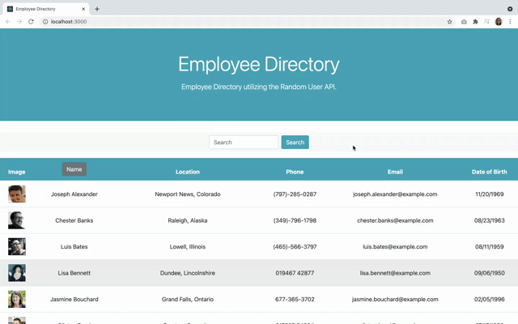

# employee_directory

## Deployed Link

https://usethehill.github.io/employee_directory/

## Demo

## Description

A simple employee directory application built with React and Material-UI. The name column is sortable (asc & desc) and you can search for a specific name in the search bar. The user can view 100 employees per page.

## Technologies Used

- HTML5
- CSS3
- JavaScript
- React JS and JSX
- Moment.js

## License

